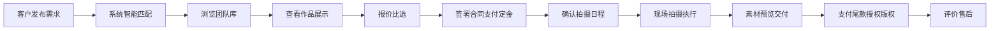

## 1. 产品概述

SkyMatch 低空航拍服务交易平台，连接婚礼策划、地产营销、活动主办方等客户与专业航拍团队，提供从需求发布到素材交付的全流程撮合服务。

- 核心价值：降低航拍服务交易成本，提升匹配效率，保障服务质量与版权合规
- 目标用户：婚礼策划师、地产营销负责人、活动主办方、专业航拍工作室

## 2. 核心功能

### 2.1 用户角色

| 角色 | 注册方式 | 核心权限 |
|------|----------|----------|
| 需求方（客户） | 手机号/邮箱注册 | 发布需求、浏览团队、比选报价、下单支付、评价售后 |
| 服务方（航拍团队） | 资质审核后入驻 | 接收订单、上传作品、管理日程、交付素材、响应投诉 |
| 平台管理员 | 后台账号 | 审核资质、处理纠纷、管理运营 |

### 2.2 功能模块

1. **需求发布页**：场地时段填写、参考样片上传、需求说明
2. **团队库页**：团队列表、资质查看、保险信息、筛选匹配
3. **作品展示页**：航拍作品集、分类浏览、风格标签
4. **报价比选页**：多团队报价、套餐配置、参数对比
5. **合同订单页**：电子合同、定金支付、订单管理
6. **拍摄日程页**：日程安排、改期申请、拍摄清单确认、联系人登记
7. **素材交付页**：素材预览、水印下载、尾款结算、版权授权
8. **评价售后页**：服务评分、投诉处理、纠纷仲裁

### 2.3 页面详情

| 页面名称 | 模块名称 | 功能描述 |
|----------|----------|----------|
| 需求发布 | 基础信息表单 | 填写场地地址、拍摄时段、预算范围 |
| 需求发布 | 样片上传 | 拖拽上传参考样片、添加风格备注 |
| 需求发布 | 需求说明 | 拍摄要求、特殊场景、交付标准描述 |
| 需求发布 | 智能匹配 | 一键匹配符合条件的航拍团队 |
| 团队库 | 筛选器 | 按区域、价格、评分、设备类型筛选 |
| 团队库 | 团队卡片 | 展示头像、名称、评分、起拍价、案例数 |
| 团队库 | 团队详情 | 资质证书、保险凭证、设备清单、团队介绍 |
| 团队库 | 在线询价 | 发送询价消息、查看历史报价 |
| 作品展示 | 分类导航 | 婚礼/地产/活动/城市风光等分类 |
| 作品展示 | 瀑布流画廊 | 缩略图展示、hover 预览动效 |
| 作品展示 | 作品详情 | 高清大图、拍摄参数、关联团队 |
| 报价比选 | 报价列表 | 多团队报价卡片并排展示 |
| 报价比选 | 套餐配置 | 选择飞行时长、机位数量、后期服务 |
| 报价比选 | 对比表格 | 价格、包含服务、交付周期对比 |
| 合同订单 | 电子合同 | 标准模板、在线签署、条款确认 |
| 合同订单 | 定金支付 | 30% 定金在线支付、支付凭证 |
| 合同订单 | 订单管理 | 订单状态跟踪、历史订单查询 |
| 拍摄日程 | 日历视图 | 拍摄日期标记、时间轴展示 |
| 拍摄日程 | 改期申请 | 提交改期原因、协商新日期 |
| 拍摄日程 | 拍摄清单 | 确认必拍场景、特殊要求 checklist |
| 拍摄日程 | 联系人登记 | 现场负责人、联系方式、紧急联系人 |
| 素材交付 | 素材预览 | 带水印缩略图网格、分类浏览 |
| 素材交付 | 水印下载 | 低清水印样片下载预览 |
| 素材交付 | 尾款结算 | 确认收货后支付尾款 |
| 素材交付 | 版权授权 | 授权范围选择、版权协议签署 |
| 评价售后 | 服务评分 | 专业度、时效性、沟通满意度 5 星评分 |
| 评价售后 | 文字评价 | 评价内容、上传对比图 |
| 评价售后 | 投诉处理 | 提交投诉、上传证据、平台介入 |

## 3. 核心流程

用户发布航拍需求 → 系统智能匹配团队 → 客户浏览团队作品和报价 → 比选后选择团队 → 签署合同支付定金 → 确认拍摄日程和清单 → 现场执行拍摄 → 素材上传预览 → 支付尾款获取版权 → 评价服务或投诉售后

## 4. 用户界面设计

### 4.1 设计风格

- **主色调**：深空蓝 (#0A1628) 代表天空与专业，搭配科技青 (#00D4AA) 作为强调色
- **辅助色**：云层灰 (#F0F4F8)、日落橙 (#FF6B35) 用于行动按钮和警示
- **按钮风格**：微圆角 (8px)、悬停时轻微上浮 + 阴影增强
- **字体**：展示字体用 "Space Grotesk" 体现科技感，正文字体用 "Inter" 保证可读性
- **布局风格**：卡片式布局、玻璃态效果、大量留白营造高端感
- **图标风格**：Lucide 线性图标，统一 24px 尺寸

### 4.2 页面设计概览

| 页面名称 | 模块名称 | UI 元素 |
|----------|----------|---------|
| 需求发布 | 表单区域 | 分步骤引导、进度指示器、大输入框、拖拽上传区 |
| 团队库 | 卡片网格 | 悬停放大、渐变遮罩、评分星星、标签徽章 |
| 作品展示 | 瀑布流 | 不规则网格、图片懒加载、渐入动画、lightbox 预览 |
| 报价比选 | 对比表格 | 高亮差异项、推荐标签、侧滑比较 |
| 合同订单 | 时间线 | 订单状态节点、进度条、支付按钮动效 |
| 拍摄日程 | 日历组件 | 日期高亮、时间块、状态色标 |
| 素材交付 | 画廊 |  Masonry 布局、水印叠加、下载按钮 |
| 评价售后 | 评分组件 | 五星交互动效、评价卡片、投诉表单 |

### 4.3 响应式设计

- 采用桌面优先设计，1280px 断点以上最优展示
- 768px 断点适配平板，卡片改为 2 列
- 480px 断点适配手机，单列布局、底部导航
- 触摸优化：按钮最小尺寸 44px、足够的点击间距

### 4.4 动效与交互

- 页面加载：元素渐入 + 轻微上移动画
- 卡片悬停：transform: translateY(-4px) + box-shadow 增强
- 按钮点击：scale(0.96) 按压反馈
- 图片加载：模糊占位 → 清晰渐变过渡
- 表单验证：错误提示晃动动画、成功对勾弹出
