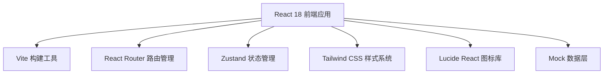
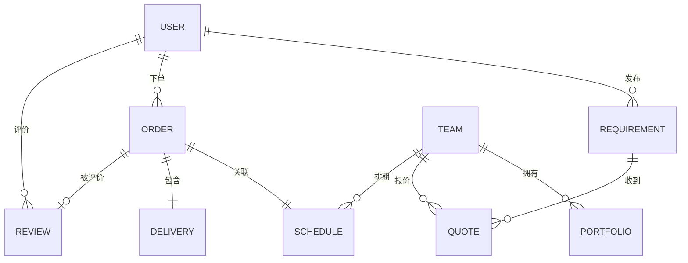

## 1. 架构设计

本项目采用纯前端架构，使用 Mock 数据模拟后端接口，便于快速演示和原型验证。



## 2. 技术描述

- **前端框架**：React@18 + TypeScript
- **构建工具**：Vite@5
- **路由管理**：react-router-dom@6
- **状态管理**：zustand@4
- **样式方案**：tailwindcss@3
- **图标库**：lucide-react
- **后端**：无后端，使用 Mock 数据演示
- **数据库**：LocalStorage 模拟持久化

## 3. 路由定义

| 路由路径 | 页面名称 | 说明 |
|----------|----------|------|
| / | 首页 | 平台介绍、入口导航 |
| /requirement | 需求发布 | 发布航拍需求表单 |
| /teams | 团队库 | 航拍团队列表与筛选 |
| /portfolio | 作品展示 | 航拍作品集展示 |
| /quotes | 报价比选 | 多团队报价对比 |
| /orders | 合同订单 | 订单管理与合同签署 |
| /schedule | 拍摄日程 | 日程安排与拍摄清单 |
| /delivery | 素材交付 | 素材预览与下载 |
| /review | 评价售后 | 服务评价与投诉 |

## 4. 数据模型定义

### 4.1 核心数据类型



### 4.2 TypeScript 类型定义

```typescript
// 用户类型
interface User {
  id: string;
  name: string;
  phone: string;
  email: string;
  role: 'client' | 'team' | 'admin';
  avatar?: string;
}

// 航拍团队
interface Team {
  id: string;
  name: string;
  logo: string;
  rating: number;
  reviewCount: number;
  basePrice: number;
  location: string;
  equipment: string[];
  certifications: string[];
  insurance: boolean;
  description: string;
  portfolioCount: number;
}

// 需求单
interface Requirement {
  id: string;
  userId: string;
  location: string;
  date: string;
  startTime: string;
  endTime: string;
  budget: number;
  category: 'wedding' | 'realestate' | 'event' | 'other';
  description: string;
  referenceImages: string[];
  status: 'draft' | 'published' | 'matched' | 'confirmed';
  createdAt: string;
}

// 报价单
interface Quote {
  id: string;
  teamId: string;
  requirementId: string;
  packageType: 'basic' | 'standard' | 'premium';
  flightHours: number;
  cameras: number;
  postProduction: boolean;
  deliveryDays: number;
  totalPrice: number;
  status: 'pending' | 'accepted' | 'rejected';
}

// 订单
interface Order {
  id: string;
  requirementId: string;
  teamId: string;
  quoteId: string;
  contractSigned: boolean;
  depositPaid: boolean;
  depositAmount: number;
  balanceAmount: number;
  status: 'pending' | 'confirmed' | 'shooting' | 'delivered' | 'completed' | 'cancelled';
  createdAt: string;
}

// 拍摄日程
interface Schedule {
  id: string;
  orderId: string;
  shootDate: string;
  shootTime: string;
  shootList: { item: string; confirmed: boolean }[];
  contactName: string;
  contactPhone: string;
  emergencyContact: string;
  rescheduleRequest?: {
    reason: string;
    newDate: string;
    status: 'pending' | 'approved' | 'rejected';
  };
}

// 素材交付
interface Delivery {
  id: string;
  orderId: string;
  materials: {
    id: string;
    name: string;
    type: 'image' | 'video';
    thumbnail: string;
    watermarkedUrl: string;
    originalUrl?: string;
  }[];
  balancePaid: boolean;
  copyrightLicense: 'personal' | 'commercial' | 'exclusive';
  deliveredAt: string;
}

// 评价
interface Review {
  id: string;
  orderId: string;
  userId: string;
  teamId: string;
  professionalism: number;
  timeliness: number;
  communication: number;
  overallRating: number;
  comment: string;
  images?: string[];
  complaint?: {
    reason: string;
    evidence: string[];
    status: 'pending' | 'processing' | 'resolved';
  };
  createdAt: string;
}
```

## 5. 项目目录结构

```
src/
├── components/          # 公共组件
│   ├── Layout/         # 布局组件
│   ├── TeamCard.tsx    # 团队卡片
│   ├── PortfolioCard.tsx # 作品卡片
│   ├── QuoteCard.tsx   # 报价卡片
│   ├── StarRating.tsx  # 评分组件
│   └── ...
├── pages/              # 页面组件
│   ├── Home.tsx
│   ├── Requirement.tsx
│   ├── Teams.tsx
│   ├── Portfolio.tsx
│   ├── Quotes.tsx
│   ├── Orders.tsx
│   ├── Schedule.tsx
│   ├── Delivery.tsx
│   └── Review.tsx
├── store/              # 状态管理
│   └── useStore.ts
├── data/               # Mock 数据
│   ├── teams.ts
│   ├── portfolio.ts
│   ├── requirements.ts
│   └── ...
├── types/              # TypeScript 类型
│   └── index.ts
├── utils/              # 工具函数
│   └── ...
├── App.tsx
├── main.tsx
└── index.css
```

## 6. 状态管理设计

使用 Zustand 管理全局状态，包含以下分片：

- `user`: 当前登录用户信息
- `teams`: 团队列表与筛选状态
- `requirements`: 需求单列表
- `quotes`: 报价单列表
- `orders`: 订单列表
- `schedule`: 拍摄日程数据
- `delivery`: 素材交付数据
- `review`: 评价与投诉数据
